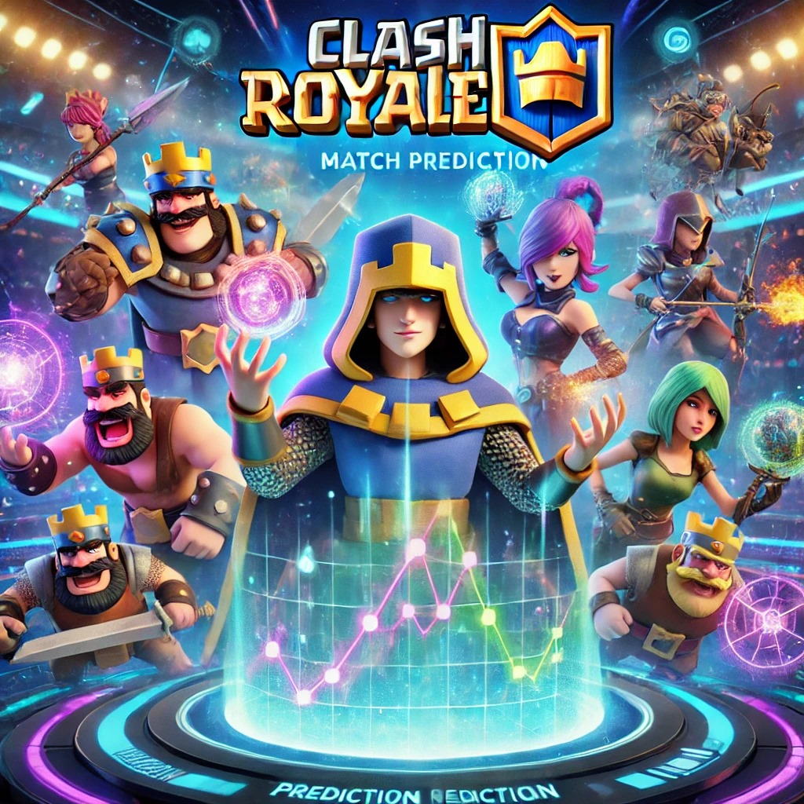

# Clash Royale - Match Prediction

This project demonstrates how to:
1. **Fetch battle data** from the Clash Royale API.
2. **Clean** the retrieved JSON data (cards, opponents, etc.).
3. **Process** the data into a tabular format using pandas.
4. Optionally, **build predictive models** or further analytics.

---

## Table of Contents
1. [Project Structure](#project-structure)
2. [Requirements](#requirements)
3. [Setup](#setup)
4. [Running the Scripts](#running-the-scripts)
5. [Usage and Overview](#usage-and-overview)
6. [License](#license)

---

## Project Structure

